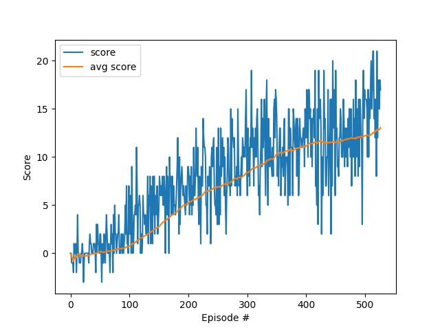
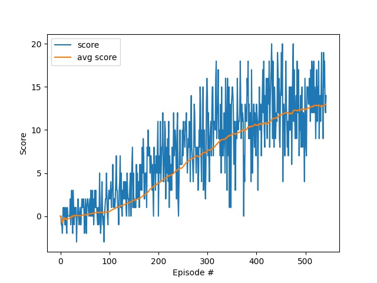

## Introduction
Deep Q-Learning with Experience Replay is used to solve the navigation problem. The repository is structured as follows:

- __navigation.py__: This is the main python script for training and demonstrating the DQN algorithm

- __model.py__: The pytorch implementation of the Q-network

- __dqn_agent__: The implementation of DQN agent and the replay buffer

## Algorithm
The vanilla [DQN](https://arxiv.org/abs/1312.5602) algorithm is chosen for this project, which utilizes the following techniques:
- __Fixed Q-Target__: Two networks are used with one approximating the target q-function and the other one approximating the current q-function. This breaks the correlation between the the target and the current approximated q-function, enhancing the training stability
- __Experience Replay__: At each time step, the agent's interaction experience is stored in a buffer for later training. Random experience samples are then drawn for each training step. This breaks the correlation between different time steps in the same episode. Also, the same experience can be utilized multiple times, thus more efficient.
- __Double DQN (DDQN)__: SARSAMAX and DQN have the tendency to overestimate values since the maximum is always picked among a set of noisy numbers. Double DQN uses two q-function approximators to perform action selection and action evaluation separately. Since DQN naturally maintains two sets of network parameters, it can be easily achieved by using the local network to pick the next action and the fixed target network to evaluate the value. The effect is compared with the vanilla DQN

Pseudo code:
```
Initialize replay memory
Initialize local q-network and target q-network

for episode i from 0 to N
    Initialize env and get the initial state
    while not done:
        Agent chooses the action a_i based on current policy
        Env generates reward, next_state, and done (finish flag)
        Save tuple (state, action, reward, next_action, done) to replay memory
        if replay memory size >  batch_size:
            Sample a minibatch
            Decide next action using local q-network
            Compute TD-target (rewards + gamma * Q_target_next * (1 - dones)) using target q-network
            Update local q-network to decrease TD-error
            Perfrom soft update to target q-network
```

Hyperparameters:
- Q-network
    - input: 37 units -> state size
    - fc1: 64 units (ReLU)
    - fc2: 64 units (ReLU)
    - fc3: 4 units (Linear) -> action size
- gamma (discount factor): 0.99
- tau (for soft update): 0.001
- learning rate: 5e-4
- n_episodes: 2000
- max episode steps: 1000
- Epsilon-greedy
    - epsilon_start: 1.0
    - eps_end: 0.01
    - eps_decay: 0.995
- Replay memory
    - buffer size: 100000
    - batch size = 64

## Result
The navigation is solved within 550 episodes for both DQN and DDQN, in fact, the training of DDQN is slightly slower than the vanilla DQN. The reason is to be investigated. Furthermore, even if the goal score has been achieved, it is observed that the agent can be stuck with suboptimal actions when it is surrounded by blue bananas, where it keeps switching between action __left__ and __right__ without being able to get away from blue bananas.

### DQN
```
Episode 100     Average Score: 0.735
Episode 200     Average Score: 5.19
Episode 300     Average Score: 8.38
Episode 400     Average Score: 11.10
Episode 500     Average Score: 12.20
Episode 527     Average Score: 13.05
```


### DDQN
```
Episode 100     Average Score: 0.528
Episode 200     Average Score: 3.84
Episode 300     Average Score: 7.47
Episode 400     Average Score: 10.55
Episode 500     Average Score: 12.44
Episode 543     Average Score: 13.00
```


## Future Work
- __Prioritized Experience Replay__: Prioritize experience samples based on their magnitudes of TD-error.
- __Dueling DQN__: Use two streams (state-value v(s) and advantage a(s, a)) in the network where the final q-value is estimated by summing the state-value and the advantage.
- __Hyperparameter Tuning__: Fine tune hyperparameters to achieve better scores and prevent suboptimal actions.